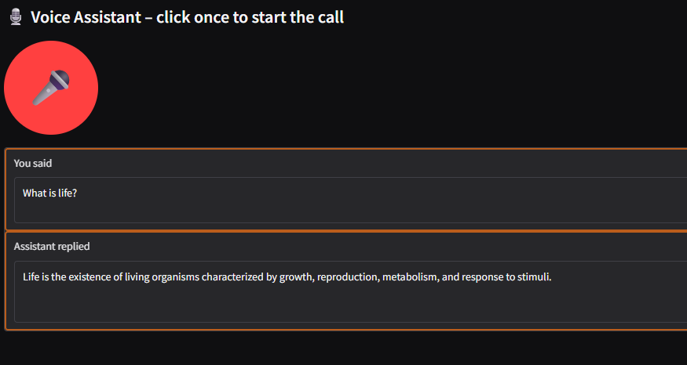

# 🎙️ Voice Assistant

A **real-time voice assistant** powered by OpenAI's GPT models and Whisper speech-to-text, with seamless text-to-speech and a Gradio web interface. Speak into your mic, get instant transcription, and have natural conversations with AI.



---

## 🚀 Introduction

This project is a Python-based voice assistant with ultra-low latency for live conversations. It records your voice, transcribes speech in real time using Faster-Whisper, generates intelligent responses with LLM, and speaks back to you. You can run it from the command line or through a Gradio web interface.

**Key Technologies:**
- [OpenAI GPT](https://platform.openai.com/docs/models) for language responses
- [Faster Whisper](https://github.com/guillaumekln/faster-whisper) for fast speech-to-text
- [Gradio](https://gradio.app/) for the web UI
- Real-time audio processing and seamless text-to-speech

---

## ✨ Features

- **Real-time voice conversation:** Speak naturally, get instant answers.
- **Fast transcription:** Uses optimized Whisper for sub-second speech recognition.
- **Seamless TTS:** Assistant replies are spoken aloud with no awkward gaps.
- **Performance tracking:** See metrics for each stage of the pipeline.
- **Gradio web UI:** Start/stop calls, see transcripts and replies, interact visually.
- **Configurable:** Easily tune models, silence detection, and TTS speed.
- **Conversation history:** Save and review your session in JSON format.

---

## 🏗️ Project Structure

- `main.py` – CLI entry point for voice conversations
- `interface.py` – Gradio-based web UI
- `conversation.py` – Orchestrates the conversation pipeline
- `audio.py` – Audio recording, silence detection, streaming to STT
- `transcription.py` – Whisper-based ultra-fast STT
- `tts.py` – Seamless TTS (Windows, extendable)
- `llm.py` – OpenAI LLM streaming response handler
- `performance.py` – Performance metrics tracker
- `config.py` – All settings and environment variables

---

## ⚡ Getting Started

### 1. Clone the Repo

```bash
git clone https://github.com/SameedHusayn/AI-Calling.git
cd AI-Calling
```

### 2. Install Dependencies

Recommended: Use a virtual environment.

```bash
python -m venv venv
source venv/bin/activate  # On Windows: venv\Scripts\activate

pip install -r requirements.txt
```

**Required Packages:**
- `openai`
- `faster-whisper`
- `sounddevice`
- `numpy`
- `gradio`
- `python-dotenv`

> See `requirements.txt` for the full list.

### 3. Set Your OpenAI API Key

Create a `.env` file in the project root:

```env
OPENAI_API_KEY=sk-xxxxxxxxxxxxxxxxxxxxxxxxxxxxxxxxxxxx
```

Or set the environment variable manually.

### 4. Run From the Command Line

```bash
python -m voice_assistant.main
```

- Speak when prompted.
- Get instant transcription and AI response.
- Press `Ctrl+C` to exit.

### 5. Run the Gradio Web Interface

```bash
python -m voice_assistant.interface
```

- Opens a browser window.
- Click the big 🎤 button to start a live call.
- See your spoken text and the assistant's reply.
---

## 📝 Saving & Reviewing Conversations

At the end of each session, your conversation and performance metrics are saved to `conversation.json`. This includes:
- Full transcript (system, user, assistant)
- Timing for each stage (audio, STT, LLM, TTS)
- Total runtime and stats

---

## 🛠️ Advanced Usage

- **Change Whisper model:** In `config.py` set `DEFAULT_WHISPER_MODEL` to `"tiny.en"`, `"base"`, or others.
- **Change LLM model:** Set `DEFAULT_LLM_MODEL` (e.g., `"gpt-4.1-nano"`)
- **Adjust TTS rate:** Set `TTS_RATE` for faster or slower speech.

---

## 🧩 Extending

- **Linux/Mac TTS:** Add support in `tts.py` for `espeak`, `say`, or other engines.
- **Other LLMs:** Swap out `llm.py` for different model providers.
- **Multilingual:** Set `DEFAULT_LANGUAGE` and corresponding Whisper models.

---

## ❓ FAQ

**Q: Does this stream responses in real time?**  
A: Yes! As soon as the LLM starts responding, you see and hear the reply with minimal delay.

**Q: Can I use this for long conversations?**  
A: Conversation history is preserved and sent to the LLM, enabling context-aware responses.

**Q: What about privacy?**  
A: Your audio and transcripts are processed locally and only sent to OpenAI for reply generation.

**Q: Is GPU required?**  
A: No, but Whisper transcription will be faster with a GPU. CPU works for small models.

---

## 🤝 Contributing

Pull requests and suggestions are welcome! See [issues](https://github.com/SameedHusayn/AI-Calling/issues) for ideas and improvements.

---

## 📜 License

MIT License. See [LICENSE](LICENSE) for details.

---

## 🙏 Acknowledgments

- [OpenAI](https://openai.com/)
- [Faster Whisper](https://github.com/guillaumekln/faster-whisper)
- [Gradio](https://gradio.app/)
- Python community

---
